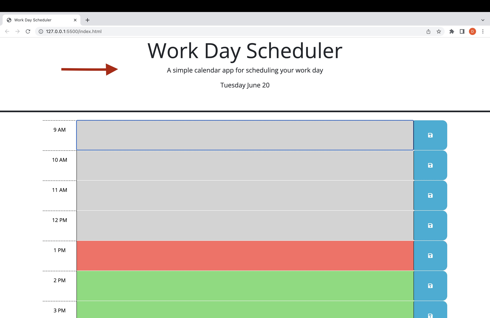
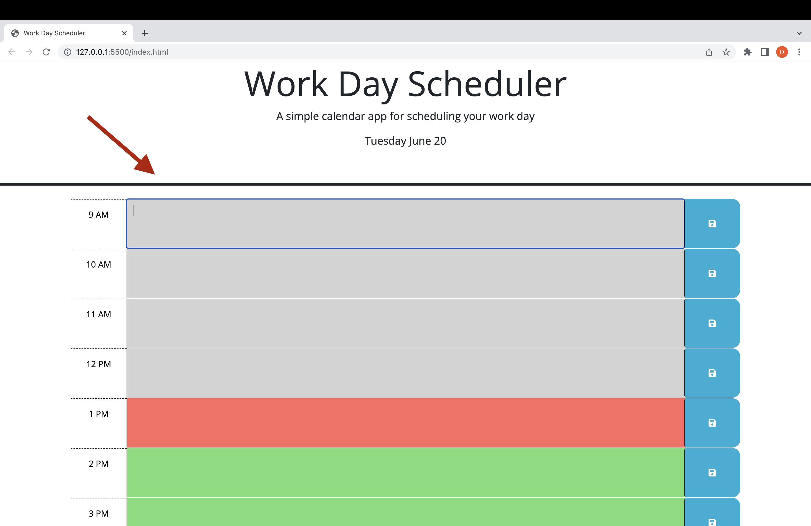
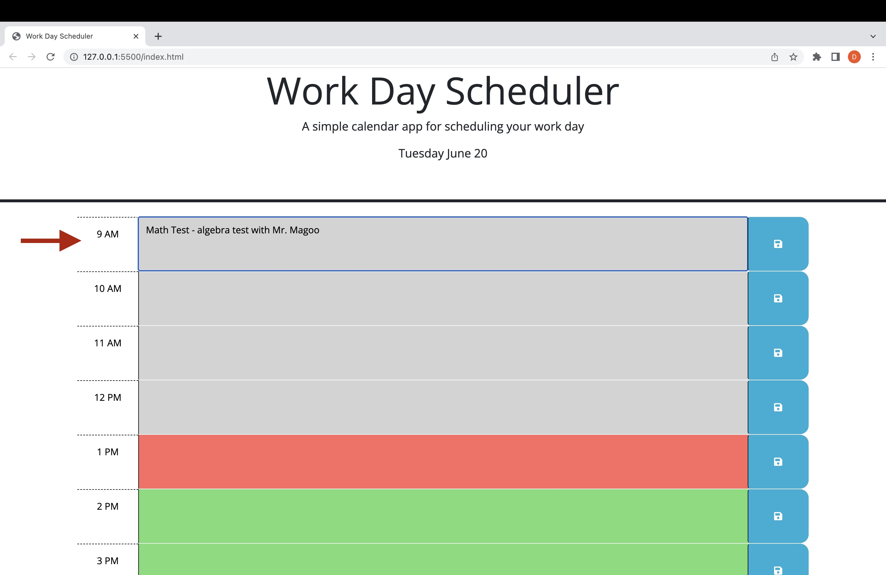
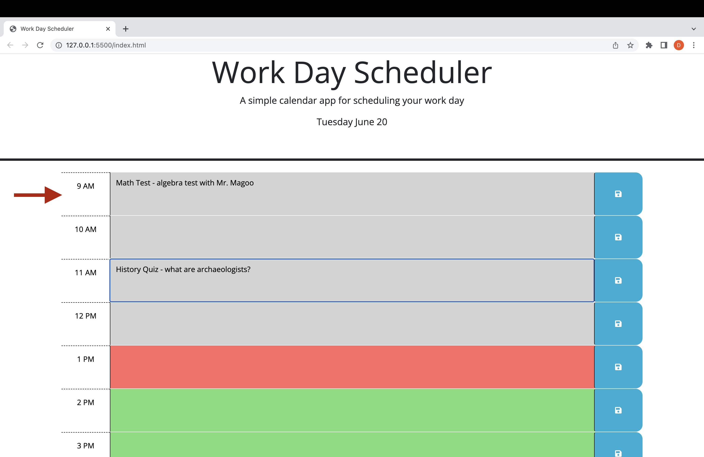
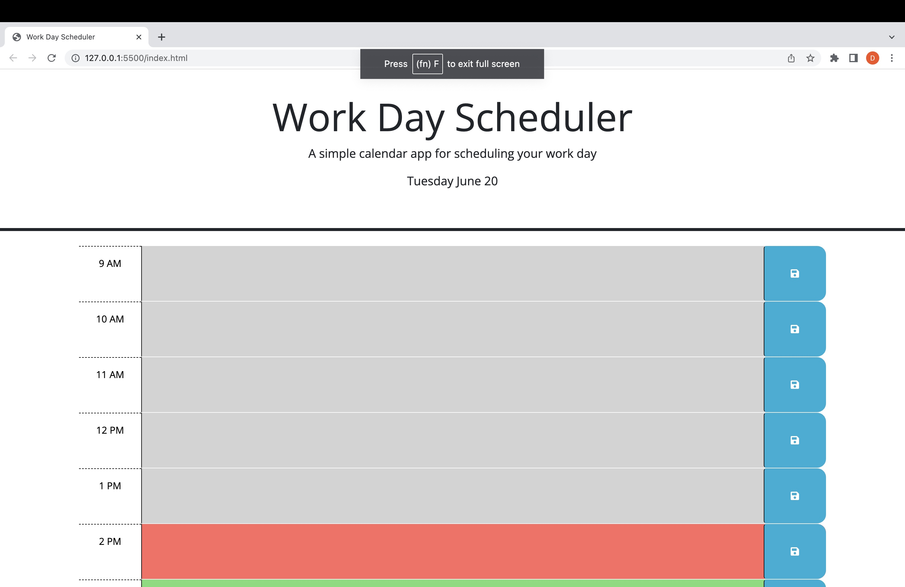

# scheduler

Description

This is a weekday scheduler application
This logs saved event data on the time block to the local storage.
Even when reloaded the data shall remain until deleted, and resaved.
The time blocks will change according to the current time. 
Past will be grey, present will be red, and future will be green.

Installation

Click on this link to load it ==>https://graycoded.github.io/scheduler/

Usage

1. Upon loading the application, you will see the title weekday scheduler followed by today's date and year directly underneath it.The days schedule time blocks from 9am to 5 pm are displayed below. 

2. Next, you should see the different time blocks having different colours based on the time of day.

3. Simply write anything that you want to have as a Events or scheduled event and press the save button at the end.

4. Once that's done, it will save to your local storage on your system, which will be kept there until it is replaced by a new event in that time slot.
5. Save multiple events one per time slot.

6. Once you are finished, the data will stay there until you remove it.

7. Thank you for checking out the GreyCoded Weekday Scheduler

License

Refer to Repo